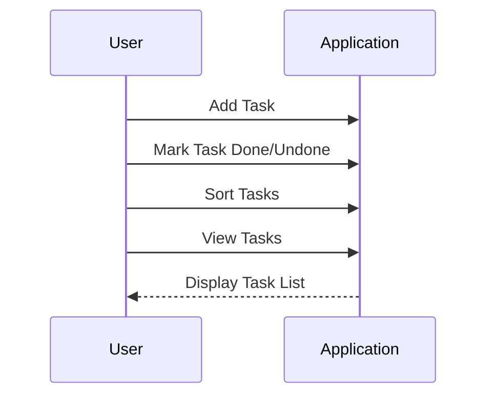
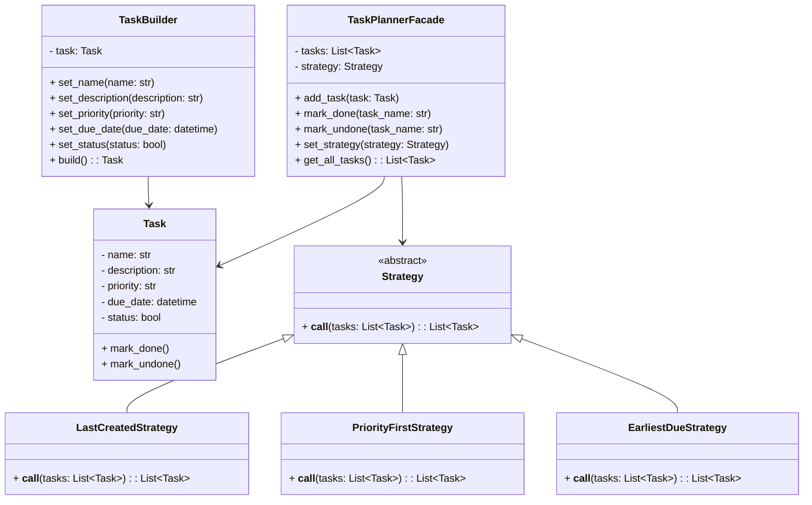

# Smart Task Planner


A desktop task management application built with Python and [Flet](https://flet.dev/) that allows users to create, organize, and manage tasks with flexible sorting strategies.

---

## 📋 Table of Contents

- [Overview](#overview)
- [Features](#features)
- [Installation](#installation)
- [Usage](#usage)
- [Project Structure](#project-structure)
- [Testing](#testing)
- [Dependencies](#dependencies)
- [Contributing](#contributing)
- [License](#license)
- [Acknowledgements](#acknowledgements)

---

## Overview

**Smart Task Planner** is a cross-platform desktop application for efficient task management. It leverages the builder, facade, and strategy design patterns to:

- Separate task construction logic (`TaskBuilder`) from business operations (`TaskPlannerFacade`).
- Offer interchangeable sorting strategies (e.g., Last Created, Priority First, Earliest Due).
- Provide a modern and responsive UI powered by Flet.

Whether you need to prioritize urgent tasks, focus on due dates, or simply see your most recent entries, Smart Task Planner adapts to your workflow.

---

## Features

- **Add Tasks**: Enter task title, description (optional), priority level, and due date.
- **Mark Complete**: Toggle task status between done and undone.
- **Flexible Sorting**:
  - **Last Created** (default): Shows newest tasks first.
  - **Priority First**: Orders tasks by priority level (⚠️ Very High → 🧘 Very Low).
  - **Earliest Due**: Sorts tasks by the soonest due date.
- **Prevent Duplicates**: Ensures tasks with the same name cannot be added twice.
- **Modular Architecture**: Easily extendable with new strategies or UI enhancements.

---

## Installation

### Prerequisites

- **Python** 3.8 or higher
- **pip** (Python package installer)

### Setup

1. **Clone the repository**
   ```bash
   git clone https://github.com/yourusername/smart-task-planner.git
   cd smart-task-planner
   ```
2. **Create a virtual environment** (recommended)
   ```bash
   python -m venv .venv
   source .venv/bin/activate    # macOS/Linux
   .\.venv\Scripts\activate   # Windows
   ```
3. **Install dependencies**
   ```bash
   pip install -r requirements.txt
   ```
4. **Run the application**
   ```bash
   python main.py
   ```

---

## Usage

1. **Launch** the app:
   ```bash
   python main.py
   ```
2. **Enter Task Details**:
   - Title: Brief summary of the task.
   - Description: (Optional) More information.
   - Priority: Select from Very High to Very Low.
   - Due Date: Pick a date using the date picker.
3. **Add Task**: Click **➕ Add Task**.
4. **Sort Tasks**: Select a strategy from the dropdown and click **🔃 Sort Tasks**.
5. **Mark Complete**: Check or uncheck the box in the **Done** column.

---

## Project Structure

```text
smart-task-planner/
├── core/
│   ├── builders/
│   │   └── task_builder.py      # Builder pattern for constructing Task instances
│   ├── facades/
│   │   └── task_facade.py       # Facade pattern for task operations
│   ├── models/
│   │   └── task.py              # Task data model
│   └── strategies/
│       ├── default_sort.py      # Base strategy interface
│       ├── earliest_due.py      # Earliest due date strategy
│       ├── last_created.py      # Last created strategy
│       └── priority_first.py    # Priority-first strategy
├── tests/
│   └── test_tasks.py            # Pytest unit tests
├── screenshots/                  # UI screenshots for README
├── main.py                       # Entry point (Flet app)
├── requirements.txt              # Dependency list
└── README.md                     # Project documentation
```
---

---

## Diagrams

### User Interaction Diagram

The following diagram illustrates how users interact with the **Smart Task Planner** application. It shows the main actions users can perform, such as adding tasks, marking them as done/undone, sorting tasks, and viewing the task list.



### Class Diagram
The class diagram below provides an overview of the main classes and their relationships within the **Smart Task Planner** application. It highlights the `Task`, `TaskBuilder`, `TaskFacade`, and various sorting strategies.



---

## Testing

Automated tests are written with [pytest](https://docs.pytest.org/).

Run all tests:
```bash
pytest --maxfail=1 --disable-warnings -v
```

### Coverage
- **Task Creation**: Validates builder outputs (name, description, priority, due date).
- **Task Operations**: Adding, marking done/undone, duplicate prevention.
- **Sorting Strategies**: Ensures correct ordering under each strategy.

---

## Dependencies

- **[Flet](https://pypi.org/project/flet/)**: UI framework for Python/web/desktop.
- **[pytest](https://pypi.org/project/pytest/)**: Testing framework.

Install via:
```bash
pip install flet pytest
```

---

## Contributing

1. **Fork** this repository.
2. **Create a branch** for your feature or bug fix:
```bash
git checkout -b feature/your-feature-name
``` 
3. **Commit** your changes:
```bash
git commit -m "feat: add new sorting strategy"
```  
4. **Push** to your branch:
```bash
git push origin feature/your-feature-name
```
5. **Open a Pull Request** and describe your changes.

---

## License

This project is licensed under the **MIT License**. See the [LICENSE](LICENSE) file for details.

---

## Acknowledgements

- Inspired by the Builder, Facade, and Strategy design patterns from the _Gang of Four_.
- UI powered by the amazing [Flet](https://flet.dev/) library.

---

*Happy task planning!*

